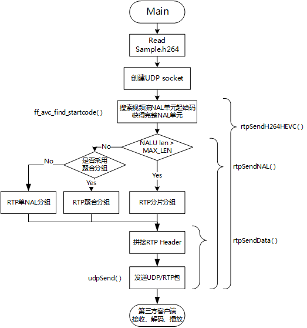

# RTP 
Implementation of a RTP server that sends video stream (H.264/HEVC) using the Real-time Transport Protocol(RTP) based on Linux/MacOS. 

一个基于Linux/MacOS平台的可以发送携带H.264/HEVC媒体类型的RTP视频流的示例程序。

## RTP-Server
这个示例程序是参考ffmpeg的代码，实现了读取一个Sample.h264裸流文件，（打算以后支持HEVC/H.265所以文件名有HEVC），通过ffmpeg内置的函数查找NAL单元起始码，从而获取一个完整的NALU。根据NALU长度选择RTP打包类型，然后再组装RTP头部信息，最终发送到指定IP和端口，本例发送到本机1234端口。



### Receive & Play Video as RTP Client

**1 .FFmpeg/ffplay**

play rtp video stream.
```sh
ffplay -protocol_whitelist "file,rtp,udp" play.sdp
```

send video file as RTP server

```sh
ffmpeg -re -i Sample.h264 -vcodec copy -f rtp rtp://127.0.0.1:1234 > play.sdp
```


**2. VLC**

Open **play.sdp** using VLC before RTPServer runs.

## RTP封装H.264码流规范
本文简单说明RTP结构和实现，详细说明请参考标准文档[RTF6184: RTP Payload Format for H.264 Video](https://tools.ietf.org/html/rfc6184)。
### RTP Header

```
     0                   1                   2                   3
     0 1 2 3 4 5 6 7 8 9 0 1 2 3 4 5 6 7 8 9 0 1 2 3 4 5 6 7 8 9 0 1
    +-+-+-+-+-+-+-+-+-+-+-+-+-+-+-+-+-+-+-+-+-+-+-+-+-+-+-+-+-+-+-+-+
    |V=2|P|X|  CC   |M|     PT      |       sequence number         |
    +-+-+-+-+-+-+-+-+-+-+-+-+-+-+-+-+-+-+-+-+-+-+-+-+-+-+-+-+-+-+-+-+
    |                           timestamp                           |
    +-+-+-+-+-+-+-+-+-+-+-+-+-+-+-+-+-+-+-+-+-+-+-+-+-+-+-+-+-+-+-+-+
    |           synchronization source (SSRC) identifier            |
    +=+=+=+=+=+=+=+=+=+=+=+=+=+=+=+=+=+=+=+=+=+=+=+=+=+=+=+=+=+=+=+=+
    |            contributing source (CSRC) identifiers             |
    :                             ....                              :
    +-+-+-+-+-+-+-+-+-+-+-+-+-+-+-+-+-+-+-+-+-+-+-+-+-+-+-+-+-+-+-+-+
```

- V(version): 当前版本设为2。
- P(padding): 载荷之后填充数据，用于要求固定长度RTP包场景，一般不用，设置为0。
- X(extension): 固定头部后面加头部扩展字段标志，一般不用，设为0。
- CC(CSRC count): CSRC字段长度
- M(marker): AU最后一个包标志位
- PT(payload): RTP载荷媒体数据类型，H264=96
- Sequence number: RTP包序列号，递增1。
- timestamp: 媒体采样时间戳，H264/HEVC统一采用90kHz采样时钟，如果使用帧率fps来设置时间戳，则递增数值为90000/fps。
- SSRC: 数据包同源标志，来自同一处的RTP包应采用固定统一数值。
- CSRC: 一般CC=0，不用此位。

### RTP Payload
RTP Packet = RTP Header + RTP payload.

RTP Payload结构一般分为3种：
1. 单NALU分组(Single NAL Unit Packet): 一个分组只包含一个NALU。
2. 聚合分组(Aggregation Packet): 一个分组包含多个NALU。
3. 分片分组(Fragmentation Unit)：一个比较长的NALU分在多个RTP包中。

各种RTP分组在RTP Header后面都跟着 `F|NRI|Type` 结构的NALU Header来判定分组类型。不同分组类型此字段名字可能不同，H264/HEVC原始视频流NALU也包含此结构的头部字段。

```
    +---------------+
    |0|1|2|3|4|5|6|7|
    +-+-+-+-+-+-+-+-+
    |F|NRI|  Type   |
    +---------------+
```
- F(forbidden_zero_bit)：错误位或语法冲突标志，一般设为0。
- NRI(nal_ref_idc): 与H264编码规范相同，此处可以直接使用原始码流NRI值。
- Type：RTP载荷类型，1-23：H264编码规定的数据类型，单NALU分组直接使用此值，24-27:聚合分组类型(聚合分组一般使用24 STAP-A)，28-29分片分组类型（分片分组一般使用28FU-A），30-31，0保留。

NAL Unit Type| Packet Type |  Packet Type Name
---|---|---|
0 | reserved | -
1-23 | NAL unit | Single NAL unit packet
24 | STAP-A | Single-time aggregation packet
25 | STAP-B | Single-time aggregation packet
26 | MTAP16 | Multi-time aggregation packet
27 | MTAP24 | Multi-time aggregation packet
28 | FU-A | Fragmentation unit
29 | FU-B | Fragmentation unit
30-31 | reserved |  -


#### 单NALU分组
此结构的NALU Header结构可以直接使用原始码流NALU Header，所以单NALU分组Type = 1~23。
封装RTP包的时候可以直接把 查询到的NALU去掉起始码后的部分 当作单NALU分组的RTP包Payload部分。

```
     0                   1                   2                   3
     0 1 2 3 4 5 6 7 8 9 0 1 2 3 4 5 6 7 8 9 0 1 2 3 4 5 6 7 8 9 0 1
    +-+-+-+-+-+-+-+-+-+-+-+-+-+-+-+-+-+-+-+-+-+-+-+-+-+-+-+-+-+-+-+-+
    |                          RTP Header                           |
    :                                                               :
    +-+-+-+-+-+-+-+-+-+-+-+-+-+-+-+-+-+-+-+-+-+-+-+-+-+-+-+-+-+-+-+-+
    |F|NRI|  Type   |                                               |
    +-+-+-+-+-+-+-+-+                                               |
    |                                                               |
    |               Bytes 2..n of a single NAL unit                 |
    |                                                               |
    |                               +-+-+-+-+-+-+-+-+-+-+-+-+-+-+-+-+
    |                               :...OPTIONAL RTP padding        |
    +-+-+-+-+-+-+-+-+-+-+-+-+-+-+-+-+-+-+-+-+-+-+-+-+-+-+-+-+-+-+-+-+

```

#### 聚合分组
通常采用STAP-A (Type=24)结构封装RTP聚合分组，下图为包含2个NALU的采用STAP-A结构的聚合分组。

```
     0                   1                   2                   3
     0 1 2 3 4 5 6 7 8 9 0 1 2 3 4 5 6 7 8 9 0 1 2 3 4 5 6 7 8 9 0 1
    +-+-+-+-+-+-+-+-+-+-+-+-+-+-+-+-+-+-+-+-+-+-+-+-+-+-+-+-+-+-+-+-+
    |                            RTP Header                         |
    :                                                               :
    +-+-+-+-+-+-+-+-+-+-+-+-+-+-+-+-+-+-+-+-+-+-+-+-+-+-+-+-+-+-+-+-+
    |STAP-A NAL HDR |         NALU 1 Size           | NALU 1 HDR    |
    +-+-+-+-+-+-+-+-+-+-+-+-+-+-+-+-+-+-+-+-+-+-+-+-+-+-+-+-+-+-+-+-+
    |                         NALU 1 Data                           |
    :                                                               :
    +               +-+-+-+-+-+-+-+-+-+-+-+-+-+-+-+-+-+-+-+-+-+-+-+-+
    |               | NALU 2 Size                   | NALU 2 HDR    |
    +-+-+-+-+-+-+-+-+-+-+-+-+-+-+-+-+-+-+-+-+-+-+-+-+-+-+-+-+-+-+-+-+
    |                         NALU 2 Data                           |
    :                                                               :
    |                               +-+-+-+-+-+-+-+-+-+-+-+-+-+-+-+-+
    |                               :...OPTIONAL RTP padding        |
    +-+-+-+-+-+-+-+-+-+-+-+-+-+-+-+-+-+-+-+-+-+-+-+-+-+-+-+-+-+-+-+-+
```


- STAP-A NAL HDR: 也是一个NALU Header (**F**|**NRI**|**Type**)结构，1字节。比如可能值为0x18=00011000b，Type=11000b=24，即为STAP-A。所有聚合NALU的F只要有一个为1则设为1，NRI取所有NALU的NRI最大值。
- NALU Size: 表示此原始码流NALU长度，2字节。
- NALU HDR + NALU Date: 即为原始码流一个完整NALU。

#### 分片分组

通常采用无DON字段的FU-A结构封装RTP分片分组。各种RTP分组在RTP Header后面都跟着 `F|NRI|Type` 结构，来判定分组类型。

```
     0                   1                   2                   3
     0 1 2 3 4 5 6 7 8 9 0 1 2 3 4 5 6 7 8 9 0 1 2 3 4 5 6 7 8 9 0 1
    +-+-+-+-+-+-+-+-+-+-+-+-+-+-+-+-+-+-+-+-+-+-+-+-+-+-+-+-+-+-+-+-+
    |                            RTP Header                         |
    :                                                               :
    +-+-+-+-+-+-+-+-+-+-+-+-+-+-+-+-+-+-+-+-+-+-+-+-+-+-+-+-+-+-+-+-+
    | FU indicator  |   FU header   |                               |
    +-+-+-+-+-+-+-+-+-+-+-+-+-+-+-+-+                               |
    |                                                               |
    |                         FU payload                            |
    |                                                               |
    |                               +-+-+-+-+-+-+-+-+-+-+-+-+-+-+-+-+
    |                               :...OPTIONAL RTP padding        |
    +-+-+-+-+-+-+-+-+-+-+-+-+-+-+-+-+-+-+-+-+-+-+-+-+-+-+-+-+-+-+-+-+
```

##### FU indicator
采用FU-A分组类型的话Type = 28，NRI与此NALU中NRI字段相同。

```
    +---------------+
    |0|1|2|3|4|5|6|7|
    +-+-+-+-+-+-+-+-+
    |F|NRI|  Type   |
    +---------------+
```

##### FU header

```
    +---------------+
    |0|1|2|3|4|5|6|7|
    +-+-+-+-+-+-+-+-+
    |S|E|R|  Type   |
    +---------------+
```

此结构中Type采用原始码流NALU中的Type字段，S=1表示这个RTP包为分片分组第一个分片，E=1表示为分片分组最后一个分片。除了首尾分片，中间的分片S&E都设为0。R为保留位，设为0。

本文发表在CSDN [RTP协议介绍以及C语言实现具有发送H.264视频功能的RTP服务器](https://blog.csdn.net/shaosunrise/article/details/80374523)。